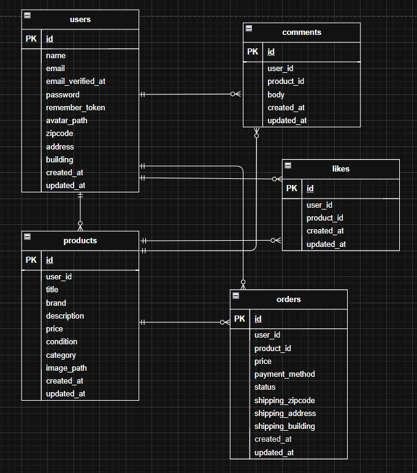

# フリマアプリ（coachtech 模擬案件）

15画面のモックに準拠した学習用フリマアプリです。  
認証（登録／ログイン／メール認証）、商品一覧・検索、商品詳細（いいね・コメント）、購入フロー（支払方法選択＋送付先変更）、プロフィール表示・編集、出品（複数カテゴリ選択・画像アップロード）を実装しています。

---

## 環境構築（Docker）

> 事前に Docker / Docker Compose をインストールしてください。

### 取得方法
 git clone リンク
    - git clone `https://github.com/terat12/flea-market.git`
    - cd flea-market

### 起動～初期化
   docker compose up -d --build
   docker compose exec php composer install
   cp .env.example .env
     （.env の主な想定値）
    - APP_URL=http://localhost
    - DB_CONNECTION=mysql
    - DB_HOST=mysql
    - DB_PORT=3306
    - DB_DATABASE=laravel_db
    - DB_USERNAME=laravel_user
    - DB_PASSWORD=laravel_pass
    - MAIL_MAILER=smtp
    - MAIL_HOST=mailhog
    - MAIL_PORT=1025
   docker compose exec php php artisan key:generate
   docker compose exec php php artisan migrate
   docker compose exec php php artisan db:seed
   docker compose exec php php artisan storage:link

> 注意：`.env` は機密情報を含むためコミットしないでください。

---

## 開発環境 URL
- アプリ本体: http://localhost/
- ユーザー登録: http://localhost/register
- MailHog（認証メール確認）: http://localhost:8025
- phpMyAdmin：http://localhost:8080

---

## 使用技術（実行環境）
- PHP 8.1 / Laravel 8.x（Fortify 認証）
- MySQL 8
- Nginx + PHP-FPM（Docker）
- MailHog

---

## ER 図

